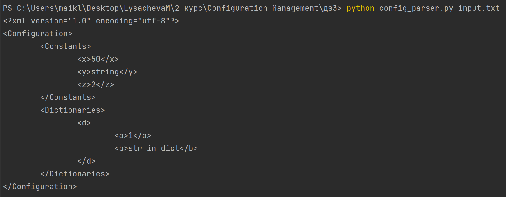

# Конфигурационное управление
## Домашнее задание №3. Вариант 22:

Разработать инструмент командной строки для учебного конфигурационного языка, синтаксис которого приведен далее. 
Этот инструмент преобразует текст из входного формата в выходной.
Синтаксические ошибки выявляются с выдачей сообщений. 

Входной текст на учебном конфигурационном языке принимается из файла, путь к которому задан ключом командной строки.
Выходной текст на языке xml попадает в стандартный вывод. 

**Многострочные комментарии** 

=begin 
Это многострочный 
комментарий 
=end 

**Словари**

{
имя -> значение. 
имя -> значение. 
имя -> значение.
} 

**Имена**

[a-zA-Z][a-zA-Z0-9]* 

**Значения** 

• Числа.

• Строки. 

• Словари. 

**Строки** 

[[Это строка]] 

**Объявление константы на этапе трансляции**

let имя = значение 

**Вычисление константного выражения на этапе трансляции (постфиксная форма), пример**

!(имя 1 +) 

Результатом вычисления константного выражения является значение. 
Для константных вычислений определены операции и функции: 
1. Сложение. 
2. Вычитание. 
3. Умножение. 
4. chr(). 
5. pow().

Все конструкции учебного конфигурационного языка (с учетом их возможной вложенности) должны быть покрыты тестами.
Необходимо показать 3 примера описания конфигураций из разных предметных областей.

# Необходимые библиотеки
Для запуска программы, тестирующей функции, необходима библиотека `pytest`
Установка:
```BASH
pip install -U pytest
```

# Запуск
Для запуска проекта необходимо иметь сам проект (например, путем клонирования репозитория).
Перед запуском убедитесь в наличии необходимых библиотек

Запуск основной программы:
```Bash
python config_parser.py <path/to/input.txt>
```

Запуск тестирующей программы
```BASH
pytest -v test.py
```

# Тестирование

test.py


config_parser.py

Входные данные (input.txt):
```text
=begin
Это многострочный
комментарий
=end

let x = 50
let y = [[ string ]]

d = {
    a -> 1.
    b -> [[ str in dict ]].
}

let z = !(x chr())
```

Результат:

