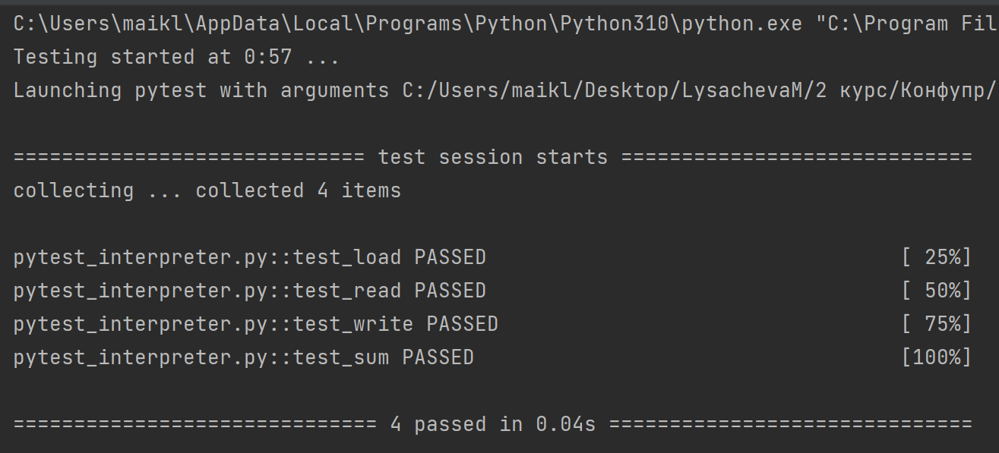

# Конфигурационное управление
## Домашнее задание №4. Вариант 22:

Разработать ассемблер и интерпретатор для учебной виртуальной машины 
(УВМ). Система команд УВМ представлена далее. 

Для ассемблера необходимо разработать читаемое представление команд 
УВМ. Ассемблер принимает на вход файл с текстом исходной программы, путь к 
которой задается из командной строки. Результатом работы ассемблера является 
бинарный файл в виде последовательности байт, путь к которому задается из 
командной строки. Дополнительный ключ командной строки задает путь к файлу
логу, в котором хранятся ассемблированные инструкции в духе списков 
“ключ=значение”, как в приведенных далее тестах. 

Интерпретатор принимает на вход бинарный файл, выполняет команды УВМ 
и сохраняет в файле-результате значения из диапазона памяти УВМ. Диапазон 
также указывается из командной строки. 

Форматом для файла-лога и файла-результата является xml. 
Необходимо реализовать приведенные тесты для всех команд, а также 
написать и отладить тестовую программу.

**Загрузка константы**

| A | B |

| Биты 0—6 | Биты 7—29 |

| 104 | Константа |

Размер команды: 4 байт. Операнд: поле B. Результат: новый элемент на стеке. 

Тест (A=104, B=920):

0x68, 0xCC, 0x01, 0x00 

**Чтение значения из памяти**

| A | B |

| Биты 0—6 | Биты 7—27 |

| 45 | Адрес |

Размер команды: 4 байт. Операнд: значение в памяти по адресу, которым 
является поле B. Результат: новый элемент на стеке. 

Тест (A=45, B=255):

0xAD, 0x7F, 0x00, 0x00

**Запись значения в память**

| A |

| Биты 0—6 |

| 8 |

Размер команды: 4 байт. Операнд: элемент, снятый с вершины стека. 
Результат: значение в памяти по адресу, которым является элемент, снятый с 
вершины стека. 

Тест (A=8):

0x08, 0x00, 0x00, 0x00

**Бинарная операция: сложение**

| A | B |

| Биты 0—6 | Биты 7—18 |

| 91 | Смещение |

Размер команды: 4 байт. Первый операнд: значение в памяти по адресу, 
которым является сумма адреса (элемент, снятый с вершины стека) и смещения 
(поле B). Второй операнд: элемент, снятый с вершины стека. Результат: новый 
элемент на стеке. 

Тест (A=91, B=339):

0xDB, 0xA9, 0x00, 0x00

**Тестовая программа**

Выполнить поэлементно операцию сложение над двумя векторами длины 4. 
Результат записать во второй вектор. 

# Необходимые библиотеки
Для запуска программы, тестирующей функции, необходима библиотека `pytest`
Установка:
```BASH
pip install -U pytest
```

# Запуск
Для запуска проекта необходимо иметь сам проект (например, путем клонирования репозитория).
Перед запуском убедитесь в наличии необходимых библиотек

Запуск assembler.py:
```Bash
python assembler.py <path/to/program.asm> <path/to/bin_file.bin> -l <path/to/log.xml>
```

Запуск interpreter.py:
```Bash
python interpreter.py <path/to/bin_file.bin> <path/to/result.xml> <left_boundary:right_boundary>
```

Запуск программы, тестирующей assembler.py
```BASH
pytest -v pytest_assembler.py
```

Запуск программы, тестирующей interpreter.py
```BASH
pytest -v pytest_interpreter.py
```

# Тестирование

## Тест

Входные данные: (program.asm)

A = (1, 15, 30, 5)

B = (4, 3, 2, 1)

```asm
LOAD 104 1
LOAD 104 15
LOAD 104 30
LOAD 104 5

WRITE 8
WRITE 8
WRITE 8
WRITE 8

LOAD 104 4
LOAD 104 3
LOAD 104 2
LOAD 104 1

SUM 91 0
SUM 91 3
SUM 91 8
SUM 91 8

```

Выходные данные: (res.xml)

B = (1, 15, 30, 5)

```xml
<?xml version="1.0" encoding="utf-8"?>
<result>
	<register address="1">1</register>
	<register address="5">5</register>
	<register address="15">15</register>
	<register address="30">30</register>
</result>

```


## Ассемблер


## Интерпретатор



